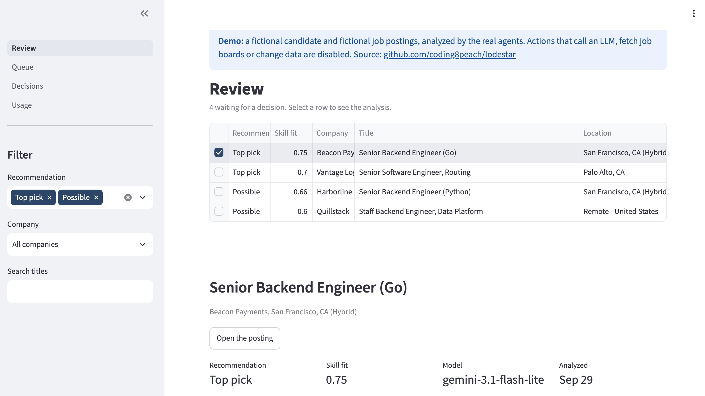
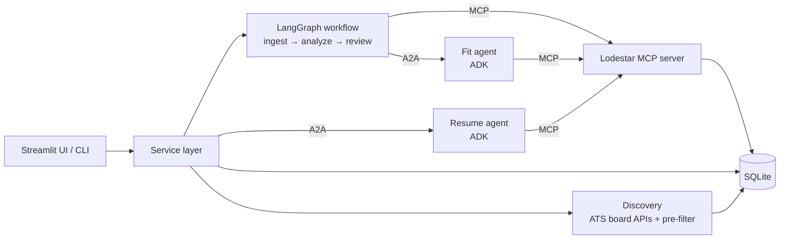

# Lodestar

**An AI job-search assistant that finds postings, judges fit requirement by requirement, and
keeps a human in charge of every decision.**

Lodestar lists the job boards of companies you follow, filters the postings for free, and sends
only the plausible ones to an LLM agent that judges each requirement against your profile.
Python turns those judgments into a score; you approve or reject; a second agent drafts a resume
tailored to each approved job, and Python checks that it invents nothing.

**Live demo:** _link coming soon_ (a fictional candidate and fictional postings, analyzed by the real agents; read-only)



## Why it's built this way

Each technology has a real job, not a demo role:

| Technology | Its job in Lodestar |
|---|---|
| **MCP** | The Lodestar MCP server gives agents typed, read-only tools: `get_job`, `get_profile`, `get_fit_analysis`, plus `ingest_url` for the workflow |
| **Google ADK** | Runtime for the two LLM agents (fit analysis, resume tailoring) |
| **A2A** | The workflow and UI reach the agents over A2A: a real framework boundary (LangGraph ↔ ADK), and each agent is its own service |
| **LangGraph** | The main workflow, with human review as an `interrupt()` |
| **Python** | Everything deterministic: pre-filter, ranking, scoring, checks, fallback, cost tracking |



## Design decisions worth reading

- **The LLM judges; Python does arithmetic.** The fit agent returns only per-requirement
  judgments (must-have or nice-to-have; direct, related or gap; evidence as profile entry ids).
  It never produces a score: if the schema had one, you'd get two scores that disagree.
- **Adjacent experience counts.** "Related" is a first-class match level (Oracle for PostgreSQL,
  Java for Go), because postings are wish lists.
- **Hard constraints gate; skills score.** Location or work authorization can't be averaged away:
  an unmet must-have constraint makes a job *blocked*; it doesn't lower the skill score.
- **Free filtering before any LLM spend.** Company boards are listed through the Greenhouse,
  Lever and Ashby APIs (one request per company), deduplicated, pre-filtered by rules, and ranked
  deterministically. In the first real run, 796 postings became 80 candidates for analysis.
- **Fallback between models happens per run, not per call.** An early version switched providers
  mid-conversation; each provider leaves its own artifacts in a history (reasoning fields,
  thought signatures), and the next one rejected them. Now each attempt is a fresh agent on one
  model, and only a job id crosses the boundary. Temporary overloads retry the same model first.
- **The resume agent selects and rewords; it never invents.** Every line cites the profile
  entries it's based on. Python fills in all facts (titles, companies, dates) and rejects skills
  not in the profile, numbers not in the cited sources, unsupported claim words ("proven",
  "high-scale"), and placeholders, with one retry that lists the problems.
- **Measured, not assumed.** A golden dataset of hand-labeled postings, repeated eval runs (LLM
  scores vary 0.05–0.20 between identical runs, so changes are judged on averages), offline
  rescoring, and per-call usage and cost tracking with a daily cap on paid models.

## Running it

Python 3.12 and [uv](https://docs.astral.sh/uv/).

```bash
uv sync
LODESTAR_DEMO=1 LODESTAR_DB=demo/demo.sqlite LODESTAR_PROFILE=demo/profile.yaml uv run lodestar ui
```

That opens the read-only demo. With your own profile and API keys:

```bash
cp .env.example .env            # add GOOGLE_API_KEY (and optionally others), LODESTAR_FIT_MODELS
cp profile.example.yaml data/profile.yaml
uv run lodestar-agent           # terminal 1: the fit and resume agents (A2A, ports 8001 and 8002)
uv run lodestar ui              # terminal 2: Queue → Find → Analyze → Review → Decisions
```

The same steps from the terminal: `lodestar discover`, `lodestar analyze`, `lodestar review`,
`lodestar tailor JOB_ID`, `lodestar usage`.

## Project layout

```text
src/lodestar/
  schemas/      Pydantic models shared by everything
  db/           SQLite with migrations, lifecycle rules, usage records
  ingest/       ATS adapters, discovery, pre-filter, ingest_url
  mcp_server/   the Lodestar MCP server
  fit_agent/    fit agent, shared model runner (fallback, retries, usage), A2A server and client
  resume_agent/ resume agent
  resume/       resume checks, assembly, Markdown and Word rendering
  workflow/     LangGraph workflow and CLI
  app/          service layer: the only thing a UI calls
  ui/           Streamlit pages
demo/           fictional candidate and postings, and the script that builds the demo database
eval/           golden-set evaluation tools
tests/          about 300 tests; no live LLM calls (scripted fake models, real MCP subprocess)
```

## Roadmap

- Agreement view: how often my decisions match the agent's recommendations, to tune the cutoff
- Mark postings closed when they disappear from their board
- Gap report: which requirements come up most often as gaps, and what to learn next
- A FastAPI + React front end over the same service layer
